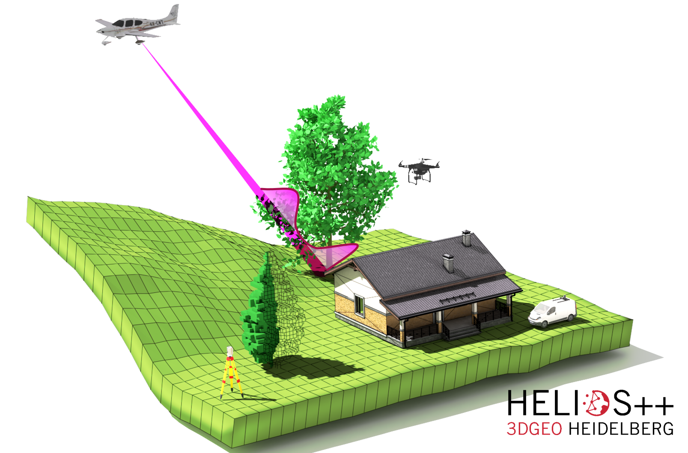

# HELIOS

> Heidelberg LiDAR Operations Simulator (HELIOS)

HELIOS has been deprecated as of 01/2021. For any new projects, please use *HELIOS++*, available [here](https://github.com/3dgeo-heidelberg/helios). For ongoing projects, please consider migrating to HELIOS++.

HELIOS++ is implemented in C++, a lot faster and more memory efficient than HELIOS, and also comes with new features, including Python support.

For compatibility and reproduction purposes, we still supply a precompiled version of HELIOS here, see https://github.com/GIScience/helios/releases/tag/final.

## Legacy version

See [the old readme](README-old.md).
